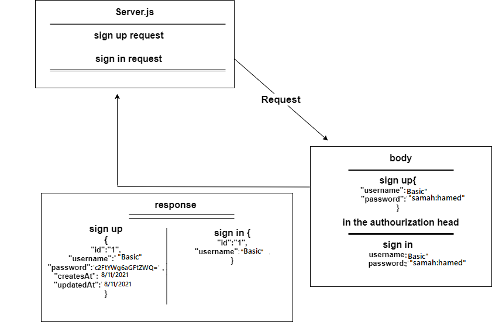

# basic-auth

* [GitHub Repo Link](https://github.com/samahhamed227/basic_auth)

* [Heroku Link](https://samah-auth.herokuapp.com/) :

*[Test](https://github.com/samahhamed227/basic_auth/actions)

##### Setup
`.env` requirements
  * `PORT` - Port Number
  * `POSTGRES_URI` : POSTGRES_URI

**Running the app**
* `npm start`
* Endpoints:
* ##### 1 -  `/status`

Returns Object

>{
  "domain": "https://basic-express-serv.herokuapp.com/status",
  "status": "running",
  "port": 3000
}

* ##### 2 -  `/signin`
`using get method`

***If the user is existed***
Returns Object
> {
    "id": 1,
    "userName": "",
    "userPassword": "",
    "createdAt": "",
    "updatedAt": ""
}

***If the user not existed or the password is wrong existed***

Returns
> "Invalid User"

* ##### 3 -  `/signup`
`using post method`

***If the user not existed***
Returns Object
> {
    "id": 1,
    "userName": "",
    "userPassword": "",
    "updatedAt": "",
    "createdAt": ""
}

# uml 

***If the user is existed***

Returns
> "Error In Creating User"